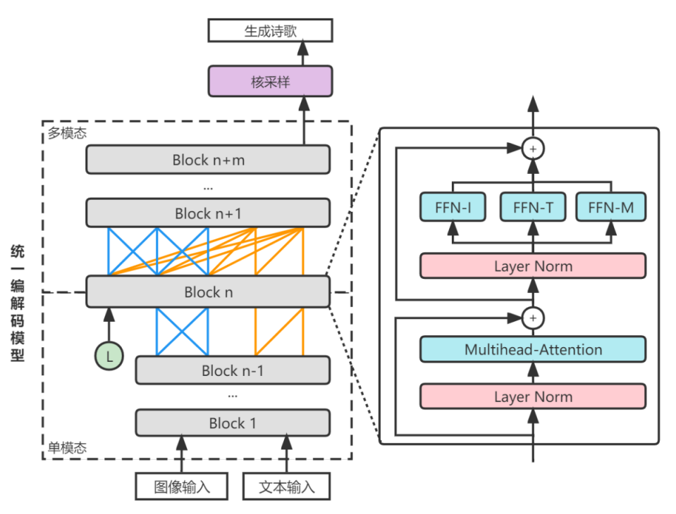

# Image-oriented poetry generation

### Overview
- **Unified Multimodal Codec Model**: A new transformer-based model structure combining the ideas of Mixture-of-Modality-Experts (Bao et al., 2021) and Unified Language Model (Dong et al., 2019), realising the capabilities for multimodal codec tasks.
- **Diverse Generation**: Integrated the idea of the latent variable (Bao et al, 2019) and kernel sampling (Holtzman et al., 2019).
- **Curriculum Learning**: Based on the poetry generation target, trained the model step-by-step through five different tasks, from general to specific, solving the lack of data about image-poetry pairs.

### Reference
- Bao, H., Wang, W., Dong, L., Liu, Q., Mohammed, O. K., Aggarwal, K., ... & Wei, F. (2021). Vlmo: Unified vision-language pre-training with mixture-of-modality-experts. arXiv preprint arXiv:2111.02358.
- Dong, L., Yang, N., Wang, W., Wei, F., Liu, X., Wang, Y., ... & Hon, H. W. (2019). Unified language model pre-training for natural language understanding and generation. Advances in neural information processing systems, 32.
- Bao, S., He, H., Wang, F., Wu, H., & Wang, H. (2019). PLATO: Pre-trained dialogue generation model with discrete latent variable. arXiv preprint arXiv:1910.07931.
- Holtzman, A., Buys, J., Du, L., Forbes, M., & Choi, Y. (2019). The curious case of neural text degeneration. arXiv preprint arXiv:1904.09751.